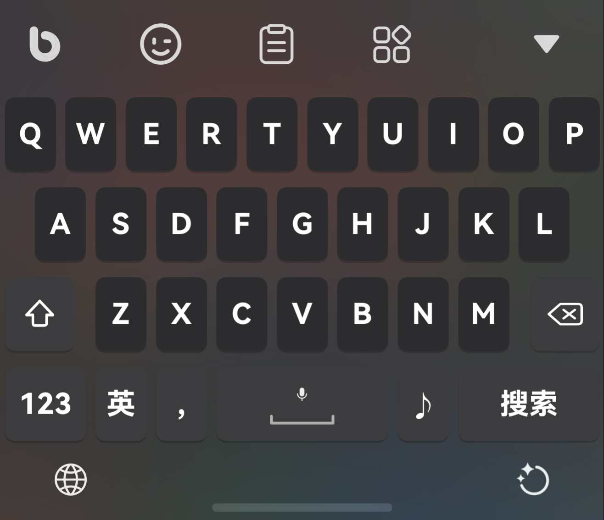

# 超越输入法：

〉https://appgallery.huawei.com/app/detail?id=app.flytype.hmos.bim&channelId=SHARE

# VGHFly「万象」：

基于原主题修改内容：

1、移除“中/英”切换按钮，将其集成至数字按键「长按符号键进行中英切换」

2、添加“ ♪ ”引导按键「实际上是分号+上滑`反查」可配合快符词库进行自定。

3、英文键盘做了习惯性的处理，空格左边加了“ @ ”按键，右边为“ . ”

4、中文键盘做了习惯性的处理，空格左边加了“ . ”按键+上滑“ / ”

## VGHFly「万象」主题样式：

 

# VGHFly「纯小鹤音形」：

基于原主题修改内容：

1、移除“中/英”切换按钮，将其集成至数字按键「长按符号键进行中英切换」

2、添加“ ♪ ”引导按键「实际上是分号+上滑句号」可配合快符词库进行自定；空格左侧为逗号+上滑问号；使用“z”上滑进行反查。

3、英文键盘做了习惯性的处理，空格左边加了“ @ ”按键，右边为“ . ”

## VGHFly「纯小鹤音形」主题样式：

 
 
# 方案来源：
〉https://github.com/jqtmviyu/flypy

〉https://github.com/cubercsl/rime-flypy

〉https://github.com/amzxyz/rime_wanxiang_pro

〉https://github.com/boomker/rime-fast-xhup